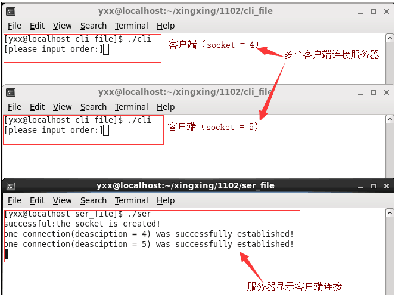
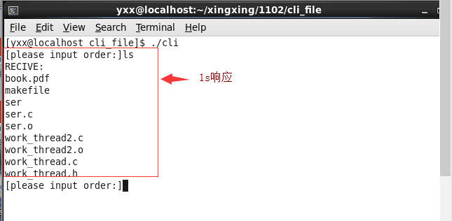
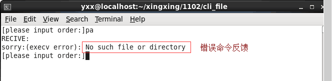
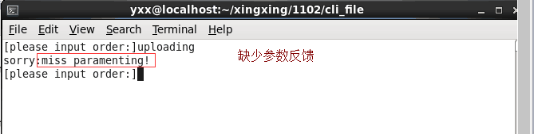
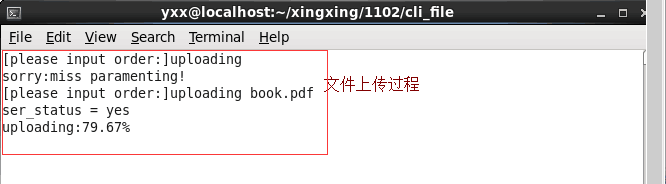
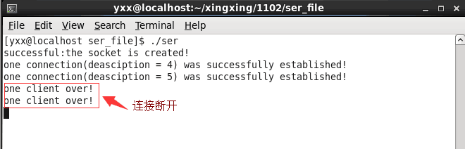

# STORAGE
  在Linux系统上使用C语言的个人项目；此项目是基于tcp传输实现服务器对客户端的命令响应；利用多线程、socket、fock、execv系列函数、文件的md5值、Makefile等实现文件上传、文件下载、VIP闪电上传下载、断点续传等功能。
### 多个客户端与服务器建立连接 ###

### 命令响应 ###

### 文件传输 ###

### 客户端和服务器断开连接  ###

## 收获  ##
- 对gdb的应用更加熟练
- 巩固网络编程流程
- 对多线程、管道的掌握
- 最自己独立设计系统框架思想培养
- Makefile文件熟练使用
- 掌握tcp、udp建立连接，断开连接原理
